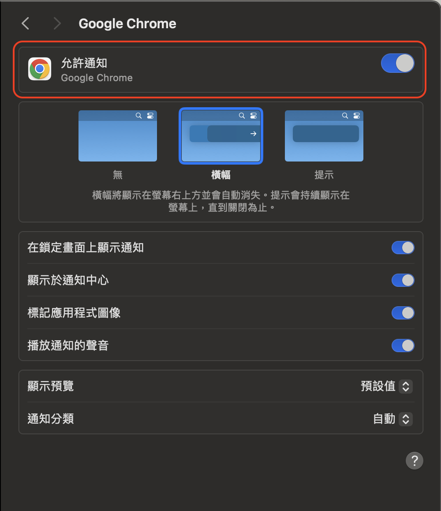
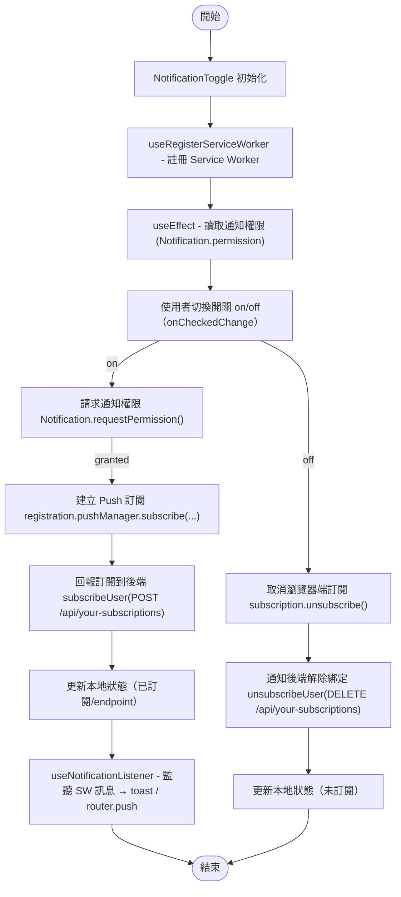
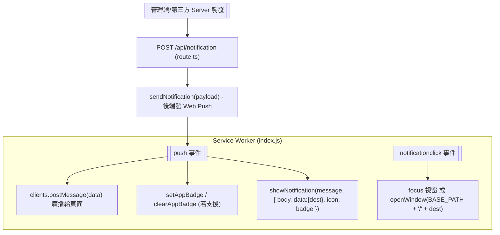

# PWA 筆記 - 推播通知實作

這是一個簡單的 Progressive Web App（PWA）範例，主要實作以下兩個功能：
* 推播通知（Push Notification）
* PWA 安裝體驗（Add to Home Screen）

最近剛好在工作上遇到類似需求，便趁機做了這個小專案，作為整合 PWA 和推播功能的 MVP，方便自己測試與驗證技術可行性，也為後續可能的擴充做準備。

同時也想藉這個機會，跟公司內部進行簡單的 Demo 與分享，讓大家對相關技術有初步了解，因此衍生出這個範例專案。

> NOTE：本專案純屬個人練習用途，內容與公司實際專案無關，亦不涉及任何業務邏輯或商業模型。


## 專案目標
該專案主要在展示如何使用 Next.js 和相關技術來實現 PWA 的功能，特別是推播通知的功能。

## 功能概述
- **推播通知**：用戶可以訂閱推播通知，並在收到通知時顯示在設備上。
- **PWA 安裝**：用戶可以將應用安裝到桌面，提供類似原生應用的體驗。
- **通知管理**：用戶可以開啟或關閉通知訂閱，並查看通知內容。

## 技術棧
- **web-push**：用於推播通知的服務。
- **next-pwa**：Next.js 的 PWA 套件。
  - 自動協助產生 service-worker.js：透過 next-pwa 自動生成並管理 service-worker.js。
  - 支援自訂 service-worker.js，你可以在 worker/index.js 定義自己的推播通知邏輯。

## 主要文件和結構
- **README.md**：提供了如何生成 VAPID keys 和設置環境變數的指南。
- **generateManifest.mjs** 和 **generateResizedImages.mjs**：用於生成 PWA 所需的 manifest 和圖標。
- **components/**：包含各種 UI 元件，如通知開關、安裝按鈕等。
- **hooks/**：包含自定義的 React hooks，用於註冊 Service Worker 和監聽通知。
- **worker/index.js**：Service Worker 的實現，用於處理推播通知。

## 環境設定

### 0. 確認本身主機是否有開啟瀏覽器通知的設定

在測試推播通知功能前，請先確認電腦系統已允許瀏覽器顯示通知。
以 Mac + Chrome 為例，請到 系統設定 → 通知 → Google Chrome，開啟「允許通知」選項，並確保其他相關通知權限（例如顯示於通知中心、播放通知聲音等）也已啟用，這樣才能正常接收到推播訊息。



### 1. 產生 VAPID Keys

首先需要產生推播通知所需的 VAPID (Voluntary Application Server Identification) keys：

```bash
npx web-push generate-vapid-keys
```

### 2. 設置環境變數

將生成的 VAPID keys 設置到環境變數中：

```bash
# .env
# 設置 vapid public key
NEXT_PUBLIC_VAPID_PUBLIC_KEY=BBmjtePily0Ij9mYW6F-xfwtC1LwyNZ5HGbsPrTTGUMyci973JQy6ly8L8iPvrMb360eKNWdk6F6gOyWOx6F8pg
# 設置 vapid private key
VAPID_PRIVATE_KEY=5qN7FUqNd7_3CSR1xreutDXMKJL5fvbil-ggpx-MtHg
# 設置 base path
NEXT_PUBLIC_BASE_PATH=/rick-push-notification
```

> 注意：請確保 NEXT_PUBLIC_BASE_PATH 的設定與 ./public/manifest.json 中 icon 的 src 路徑前綴一致，否則 PWA 圖示可能無法正確顯示。

### 3. 產生 manifest.json 以及所需圖片

```bash
./generate_assets.sh ./example.png ./public
```

該指令會產生 manifest.json 以及所需圖片，並放置於 public 資料夾下

### 4. 安裝並執行專案

```bash
npm install
npm run dev
```

## 與推播通知功能相關的資料夾結構

```plaintext    

├── actions
│   └── notification.ts // 發送推播通知的 server action
├── app
│   ├── favicon.ico
│   ├── globals.css
│   ├── layout.tsx
│   ├── not-found.tsx
│   ├── page.tsx
│   ├── providers.tsx
│   └── somewhere
├── components
│   ├── notification-sender.tsx // 發送推播通知的元件
│   ├── notification-toggle.tsx // 切換推播通知的元件
│   ├── pwa-install-button.tsx // 安裝 PWA 的元件
│   ├── read-notification.tsx // 閱讀推播通知的元件
│   └── ui // 推播通知的 UI 元件
├── constants
│   └── index.ts // 存放 service-worker.js 的路徑變數
├── enums
│   └── permission-status.ts // 存放推播通知的狀態
├── example.png // 推播通知的範例圖片
├── generateManifest.mjs // 產生 manifest.json 的指令 (透過 generate_assets.sh 呼叫)
├── generateResizedImages.mjs // 產生不同尺寸的圖片 (透過 generate_assets.sh 呼叫)
├── generate_assets.sh // 腳本，用來產生圖片和 manifest.json
├── hooks
│   ├── use-notification-listener.ts // 監聽推播通知的 hook
│   └── use-register-service-worker.ts // 註冊 Service Worker 的 hook
├── lib
│   └── utils.ts // 存放常用的工具函式
├── next.config.ts // 設定 next.config.ts (包含 next-pwa 的設定)
├── public
│   ├── icons // 存放不同尺寸的圖片
│   ├── apple-touch-icon-precomposed.png // 蘋果裝置所需的圖示
│   ├── apple-touch-icon.png // 蘋果裝置所需的圖示
│   ├── geton.png // 推播通知的範例圖片
│   ├── nextjs.png // 推播通知的範例圖片
│   ├── manifest.json // 存放 manifest.json 的內容
└── worker
    └── index.js // Service Worker 檔案，處理推播通知的接收、顯示，以及點擊通知後的行為
```
# 推播通知功能流程

## 1. Service Worker 註冊
**檔案位置**: [`hooks/use-register-service-worker.ts`](hooks/use-register-service-worker.ts)   
**描述**: 當 Component On Mount 時，這個 hook 會註冊一個 service worker。它會檢查瀏覽器是否支持 service worker，並在未註冊的情況下進行註冊。

## 2. 通知權限和訂閱
**檔案位置**: [`components/notification-toggle.tsx`](components/notification-toggle.tsx)  
**描述**:
- 這個 Component 管理通知訂閱狀態
- 它向用戶請求通知權限，並使用 service worker 訂閱推播通知
- 它使用 `useNotificationListener` hook 來監聽來自 service worker 的消息

## 3. 監聽通知
**檔案位置**: [`hooks/use-notification-listener.ts`](hooks/use-notification-listener.ts)  
**描述**: 當通知被授權時，這個 hook 會監聽來自 service worker 的消息，並向用戶顯示消息。

## 4. Service Worker 推播事件處理與 Badge 管理
**檔案位置**: [`worker/index.js`](worker/index.js)  
**事件監聽器**:
- `push`: 處理傳入的推播事件，顯示通知並更新應用程式徽章
- `notificationclick`: 處理通知點擊事件，根據需要聚焦或打開新窗口

**描述**: service worker 監聽推播事件，顯示通知並管理 app badge 的數量(unread count)。

## 5. 發送通知
**檔案位置**: [`components/notification-sender.tsx`](components/notification-sender.tsx)              
**描述**: 這個 Component 提供發送通知的用戶界面。它接收一個 endpoint 並使用 `sendNotification` 動作發送通知。

## 6. 通知相關的 API
**檔案位置**: [`actions/notification.ts`](actions/notification.ts)  
**描述**: 這個檔案包含了伺服器端的通知發送功能。它使用 web-push 庫來發送推播通知，並設定了 VAPID 金鑰用於推播通知的加密和身份驗證。主要功能包括：
- 接收通知訊息和目標 endpoint
- 使用 web-push 發送通知到指定的 endpoint
- 處理錯誤並回傳適當的回應

## 7. 清除應用程式徽章
**檔案位置**: [`components/read-notification.tsx`](components/read-notification.tsx)  
**描述**: 這個 Component 提供一個按鈕來清除 app badge 的數量，使用 `navigator.clearAppBadge` API。

## 8. 彈出通知
**檔案位置**: [`components/ui/sonner.tsx`](components/ui/sonner.tsx)  
**Component**: `Toaster`  
**描述**: 這個 Component 使用 sonner 庫來顯示彈出通知，並適應當前主題。

## 元件處理流程



---

## API 觸發推播通知




## 參考文件
- [如何註冊 service worker](https://developer.mozilla.org/en-US/docs/Web/API/ServiceWorkerContainer/register)
- [Web Push GitHub](https://github.com/web-push-libs/web-push)
- [更新 PWA 圖示的徽章](https://developer.mozilla.org/en-US/docs/Web/Progressive_web_apps/How_to/Display_badge_on_app_icon#update_badges_in_real-time)
- [next-pwa 的 issue](https://github.com/shadowwalker/next-pwa/issues/424)

